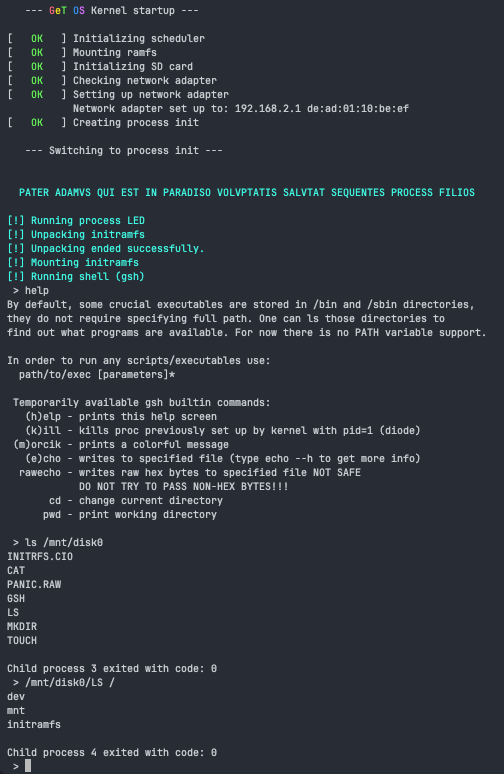

# Experimental Monolithic Kernel for RP2040/RP2350

-red?style=flat-square)


This project is a custom, monolithic operating system kernel designed specifically for the Raspberry Pi Pico (RP2040)
and the newer RP2350 microcontrollers. Written primarily in ARM Assembly to maximize low-level control and serve as an
educational deep-dive into OS architecture, it implements core features like dynamic memory allocation, a custom libc,
preemptive multitasking, and a POSIX-influenced syscall interface.

I also engineered a custom GeT Computer PCB, available [here](https://github.com/atwardzik/GeT_Computer).

⚠️ Warning: Due to the kernel's complexity, writing new assembly code outside of hardware drivers is currently highly
unsafe and not recommended. This is an experimental project intended for learning and research.



## Features

| Feature                                       | Status | Notes                                                                                        |
|-----------------------------------------------|--------|----------------------------------------------------------------------------------------------|
| Dynamic memory allocation                     | ✅      | Modified Linked-List allocator                                                               |
| Custom LIBC                                   | ✅      | For kernel and userspace                                                                     |
| Multitasking                                  | ✅      | Pre-emptive task scheduler                                                                   |
| POSIX-like syscalls                           | ✅      | [List of syscalls](https://github.com/atwardzik/os_kernel/blob/main/include/syscall_codes.h) |
| Filesystem                                    | ✅      | Virtual Filessystem structure and RAMFS                                                      |
| Networking                                    | ✅      | Raw sockets, TCP client and server                                                           |
| EXT2 support                                  | 🚧     | Planned                                                                                      |
| Multithreading                                | 🚧     | In progress                                                                                  |
| Custom C compiler and assembler for userspace | 🚧     | In progress                                                                                  |

## Drivers

| Driver                   | Status | Notes                                                         |
|--------------------------|--------|---------------------------------------------------------------|
| PS/2 keyboard driver     | ✅      | Both immediate and parallel interfaces (with shift-registers) |
| UART communication       | ✅      |                                                               |
| VGA driver (640x480)     | ✅      | Scaling up resolutions is in progress                         |
| SD card driver           | 🚧     | In progress                                                   |
| Ethernet (WIZnet W5100S) | ✅      | Raw sockets, TCP client and server                            |

## Future plans

- Porting LIBC to user space programs as a dynamic library
- Extending shell and writing user-space programs like vim-like editor
- Introducing Rust into kernel
- ELF executable support
- Memory Protection
- After full filesystem support move some parts of firmware into bootloader. The kernel and the initramfs should reside
  in the `/boot` directory

## Building

### Prerequisites

- ARM GCC toolchain (`arm-none-eabi-gcc`)
- CMake

### Build Instructions

```bash
git clone https://github.com/atwardzik/os_kernel.git
cd os_kernel
cmake -DCMAKE_EXPORT_COMMANDS=ON -DARCH_RP2350=1 -B build
cd build
make -j4
```

Depending on your needs you should choose `-DARCH_RP2040=1` or `-DARCH_RP2350=1`.

## Contributing

Issues and pull requests are welcome! Please open an issue before starting major work.

## License

Open-source and released under the BSD 3-Clause License. Feel free to use, modify, and distribute the code in accordance
with the terms specified in the license.

Copyright (C) 2024-2026 Artur Twardzik
